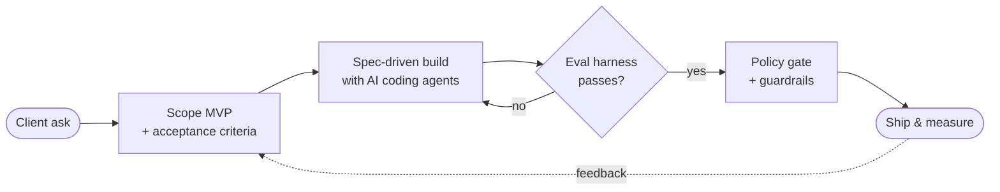

<!-- ① Header banner -->
<p align="center">
  
</p>

<!-- ② Animated typing line -->
<p align="center">
  
</p>

<!-- ③ Contact badges (flat-square, not for-the-badge) -->
<p align="center">
  <a href="https://www.linkedin.com/in/ltthinh111/"></a>
  <a href="mailto:ltthinh111@gmail.com"></a>
  
  
</p>

---

<!-- ④ Code-block "about me" -->
```python
class LucasLam:
    role    = "Associate Technical Product Owner"
    company = "Functional AI Partners (Fun AI) — Singapore · B2B AI agents"
    focus   = ["LLM agents", "Voice AI", "RAG", "Agent evaluation"]

    def how_i_work(self):
        return [
            "Turn a vague client ask into a scoped MVP",
            "Let the LLM reason; let deterministic code decide what's allowed",
            "No agent ships without an eval that can fail it",
        ]

    fun_fact = "Same birthday as Freddie Mercury 🎤"
```

<!-- ⑤ GitHub-native alert block -->
> [!TIP]
> **Building now:** *Order Rescue*, an adaptive delivery-recovery agent for the **Sea × OpenAI Codex Hackathon** → [sea-hackathon](https://github.com/ThinhLam-git/sea-hackathon)

---

## 🔁 How I ship an AI agent

<!-- ⑥ Mermaid diagram — rendered natively by GitHub, no external service -->


---

## 🛠 Things I've shipped

<!-- ⑦ Collapsible project cards -->
<details open>
<summary><b>📞 Voice Agent QA Harness</b> — a fake caller that tests a real voice agent</summary>
<br/>

A production Japanese phone agent scored **4.13/10** in manual UAT, and the score couldn't be reproduced. I built *"Mai-san"*, a synthetic caller who phones the agent, holds a realistic conversation, and scores every call automatically.

| Scenarios | Offline tests | Real test calls | Judge |
|:---:|:---:|:---:|:---:|
| **34** | **770+** | **250+** | LLM median-of-3 |

`Python` `ElevenLabs` `Vapi` `WebSockets` `LLM-as-judge`
</details>

<details>
<summary><b>💬 Enterprise AI Assistant</b> — chat, RAG and document generation for a Japanese enterprise</summary>
<br/>

- Streaming answers (SSE) with web search and image generation
- RAG over PDF, Word, Excel, PowerPoint and scanned files (pgvector + OCR)
- Generates Excel/PowerPoint files from schema-validated tool calls, with retry
- Per-user rate limits and a cost/token ledger for every call

`FastAPI` `Postgres + pgvector` `MinIO` `Docker` `Nginx`
</details>

<details>
<summary><b>🎓 AI Course Generator</b> — slides in, narrated e-learning course out</summary>
<br/>

- A 6-stage LangGraph pipeline turns PDFs, slides and URLs into Japanese courses with quizzes and narrated video
- **My part:** the course viewer, the media pipeline and the CI/CD deploy (Cloudflare Tunnel, self-hosted runner, rollback)

`LangGraph` `Next.js` `n8n` `ffmpeg` `GitHub Actions`
</details>

---

## 🧰 Toolbox

<!-- ⑧ Skill icons, split by layer -->
<table align="center">
  <tr>
    <td align="center"><b>Build</b></td>
    <td></td>
  </tr>
  <tr>
    <td align="center"><b>Data</b></td>
    <td></td>
  </tr>
  <tr>
    <td align="center"><b>Ship</b></td>
    <td></td>
  </tr>
  <tr>
    <td align="center"><b>AI</b></td>
    <td>
      
      
      
      
      
      
    </td>
  </tr>
  <tr>
    <td align="center"><b>Product</b></td>
    <td>
      
      
      
      
    </td>
  </tr>
</table>

---

## 📊 Activity

<!-- ⑨ Contribution activity graph -->
<p align="center">
  
</p>

<!-- ⑩ Stats + top languages side by side -->
<p align="center">
  
  
</p>

<!-- ⑪ Trophies -->
<p align="center">
  
</p>

<!-- ⑫ Footer banner + visitor counter -->
<p align="center">
  
</p>
<p align="center">
  
</p>
